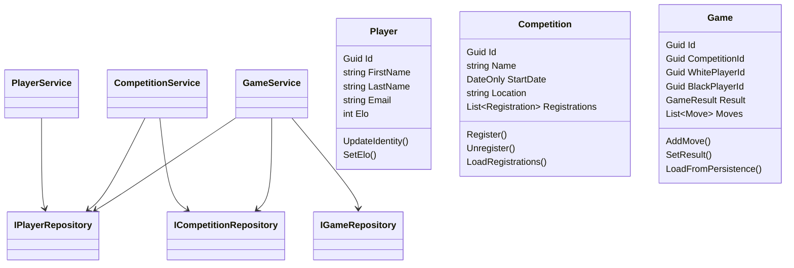
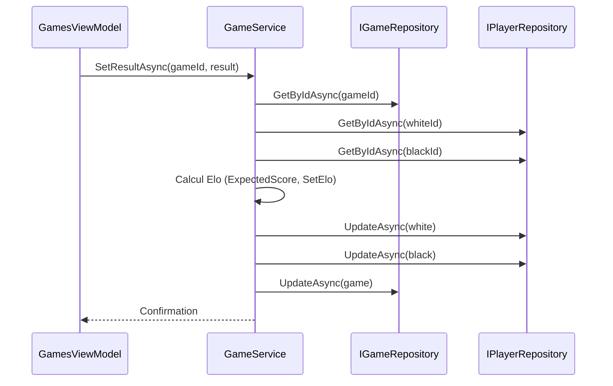
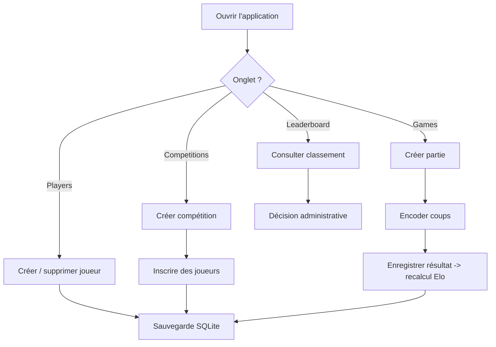

# Rapport – Chess Federation Manager

## Introduction
L’application Chess Federation Manager permet au personnel administratif d’une fédération d’échecs de gérer l’ensemble du cycle de vie des compétitions : enregistrement des joueurs, création des tournois, inscriptions, encodage des parties (coups + résultat) et recalcul automatique des classements Elo persistés dans une base SQLite. L’interface Avalonia UI rend l’outil multiplateforme et exploitable en situation de bureau.

## Fonctionnalité supplémentaire
Nous avons ajouté un onglet **Leaderboard** qui affiche le classement Elo trié de tous les joueurs. Cette vue se base sur `LeaderboardViewModel` qui rafraîchit la liste via `PlayerService` et calcule le rang de chaque joueur. Le personnel obtient ainsi une visibilité en un clic sur le classement global sans exporter la base.

## Diagramme de classes

## Diagramme de séquences

## Diagramme d’activité

## Adaptabilité à d’autres fédérations
L’architecture est orientée couches (Domain, Application, Infrastructure, UI) et utilise des interfaces pour les repositories (`IPlayerRepository`, etc.). Adapter le projet à un autre sport revient à modifier les entités du Domain (par ex. renommer `Game` en `Match`, enrichir `Move` ou la logique de scoring) sans impacter l’UI ou la persistance : il suffit de remplacer les implémentations de repositories/DTO ou d’ajouter des propriétés dans les entités. L’utilisation d’EF Core et d’une base SQLite locale rend également le stockage interchangeable avec une base Postgres ou un service REST en implémentant de nouveaux repositories.

## Principes SOLID utilisés
1. **Single Responsibility Principle (SRP)** : chaque service (`PlayerService`, `CompetitionService`, `GameService`) encapsule une responsabilité claire (gestion des joueurs, des compétitions, des parties). Cela limite l’impact des changements fonctionnels à une classe.
2. **Dependency Inversion Principle (DIP)** : les services dépendent des interfaces (`IPlayerRepository`, `IGameRepository`, …) et non des implémentations concrètes. Cela simplifie le remplacement du stockage (InMemory, EF Core, API) et facilite les tests unitaires avec des fakes.

## Conclusion
Chess Federation Manager fournit désormais la totalité des fonctionnalités attendues – incluant un classement Elo dynamique – dans une architecture proprement découpée. Les diagrammes précédents montrent comment l’application peut être adaptée facilement à d’autres fédérations en conservant les services et en ne remplaçant que la couche Domain/Infrastructure. Le respect des principes SOLID garantit que le code restera maintenable pour ajouter de futurs modules (statistiques, export, API web, etc.).
